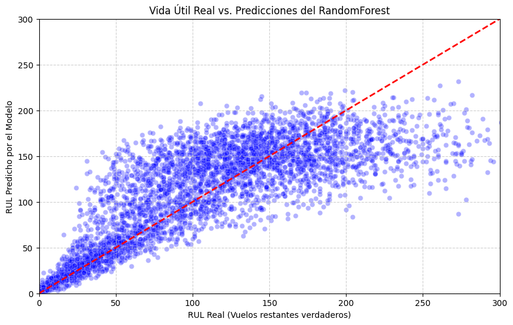
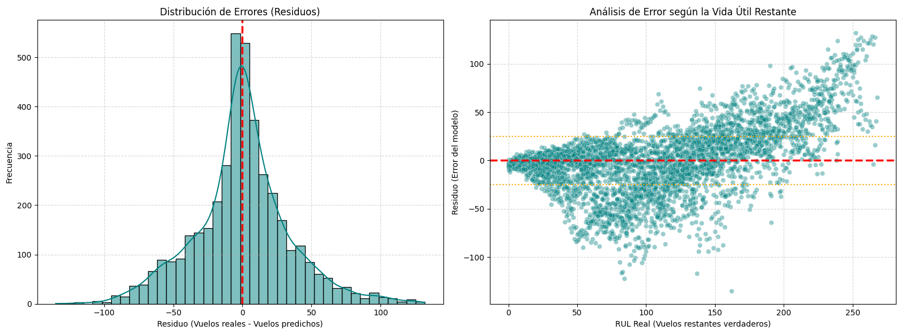
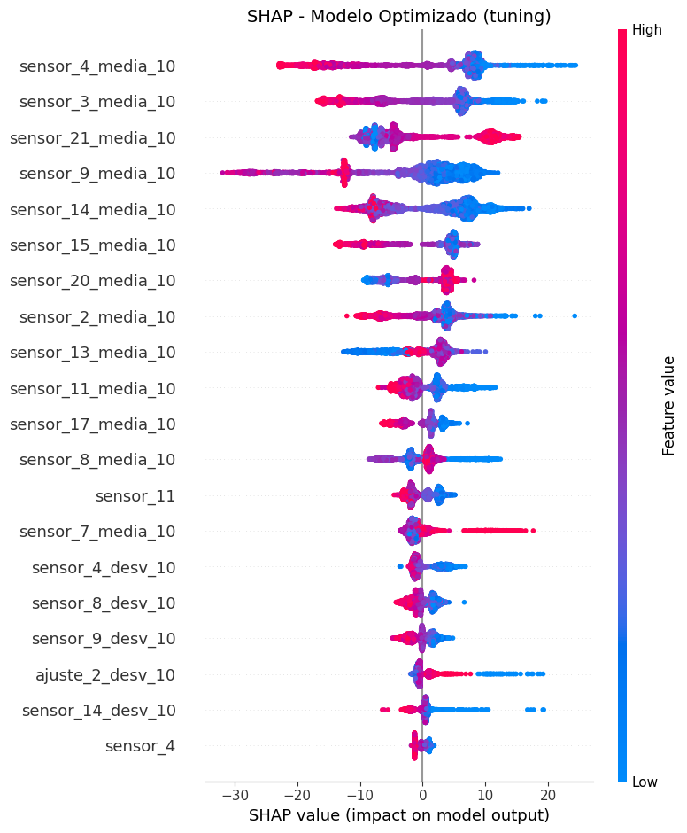
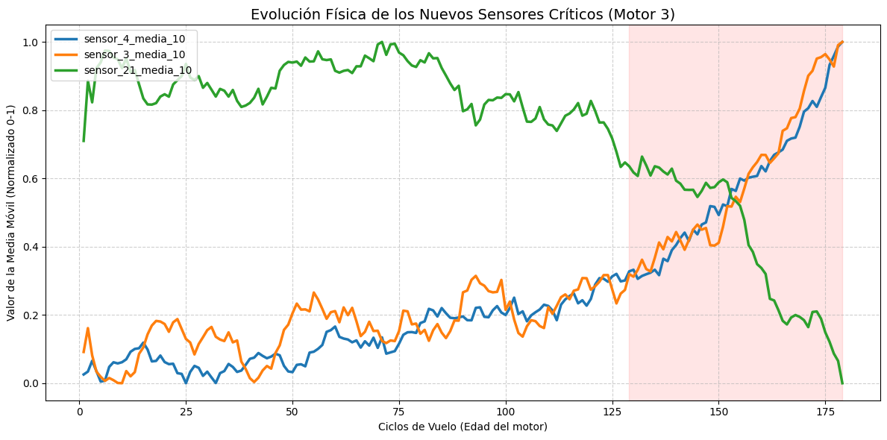
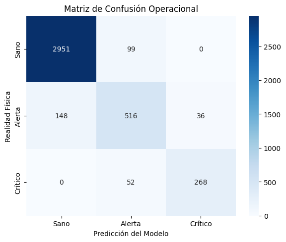

# nasa-turbofan-predictive-maintenance


An end-to-end Machine Learning pipeline designed to predict the **Remaining Useful Life (RUL)** of aircraft turbofan engines and classify their operational health state using NASA's CMAPSS dataset.

---

##  1. Project Context & Objectives
Predictive maintenance is a critical component in modern aerospace engineering. The ability to anticipate component failure prevents catastrophic accidents and optimizes maintenance schedules, saving millions in operational downtimes. 

The goal of this project is twofold:
1. **Regression Task:** Predict the exact Remaining Useful Life (RUL) in flight cycles for an engine given its current sensor readings.
2. **Classification Task:** Translate the continuous RUL prediction into an actionable 3-tier operational health alert system (Healthy, Warning, Critical).

---

##  2. The Dataset (CMAPSS FD001)
We utilized the **Commercial Modular Aero-Propulsion System Simulation (CMAPSS)** dataset provided by NASA. Specifically, the `FD001` subset, which simulates engine degradation under a single operational condition and a single fault mode (High-Pressure Compressor degradation).

The raw data consists of time-series telemetry containing:
- Engine ID and Flight Cycle.
- 3 Operational Settings.
- 21 Thermodynamic Sensors (temperatures, pressures, bypass ratios, etc.).

---

##  3. Data Cleaning & Preprocessing
To prepare the raw telemetry for machine learning, the following steps were taken:
- **Target Variable Creation (RUL):** Calculated by finding the maximum flight cycle for each specific engine and subtracting the current cycle.
- **Noise Reduction:** Calculated the standard deviation for all sensors. Sensors with a variance of `0` (Sensors 1, 5, 10, 16, 18, 19) were dropped, as they represent static engine parameters that offer no predictive value for degradation.

---

##  4. Feature Engineering: Capturing Physical Degradation
Initially, a baseline **Random Forest** was trained on the raw, instantaneous sensor readings. 


*(The baseline model struggled to capture the degradation curve accurately, predicting with an RMSE of ~41.48 cycles).*

**Engineering Decision:** Jet engine fatigue is a cumulative physical process. Instantaneous readings are too noisy. To capture structural wear and tear, I engineered historical rolling features:
- **Moving Averages (Window = 10 flights):** To smooth out sensor noise and capture the macro-trend of thermodynamic degradation.
- **Rolling Standard Deviations (Window = 10 flights):** To capture operational instability, as failing engines tend to vibrate or exhibit erratic pressure spikes.

*(Note: Adding these features initially dropped the error to 24.55 cycles, but it raised a red flag regarding data leakage, which led to the next critical architectural decision).*

---

##  5. Methodology: Preventing Data Leakage
A major pitfall in time-series predictive maintenance is **Data Leakage**. If we randomly split the rows (flights) into training and testing sets, the model learns from the future of the same engine.

**Strict Engine-Level Isolation:**
To simulate a real-world scenario where the model encounters a *completely unseen* engine, the train/test split was strictly applied by `Engine ID` (80 engines for training, 20 for testing).

Furthermore, a Scikit-Learn `Pipeline` was implemented to ensure the `StandardScaler` only learned the statistical distribution of the training engines, applying those exact transformations to the test engines without information bleed.

---

##  6. Model Benchmarking & Optimization
Three distinct algorithms were evaluated within the strict, leakage-free Pipeline architecture:

| Model | RMSE (Real/Legitimate) |
| :--- | :---: |
| 1. Ridge Regression (Baseline) | 37.40 cycles |
| 2. Random Forest Regressor | 35.09 cycles |
| **3. XGBoost Regressor** | **34.79 cycles** |

**Hyperparameter Tuning (XGBoost):**
XGBoost was selected as the final model due to its gradient boosting efficiency. Using `RandomizedSearchCV`, the model was heavily regularized to prevent overfitting on the early-life noise of the engines:
- `max_depth = 3` (Shallow trees to focus on macro-trends).
- `subsample = 0.8` & `colsample_bytree = 1.0`.
- `learning_rate = 0.05` & `n_estimators = 200`.

**Final Optimized RMSE: 33.73 cycles.**

### Error Analysis (Residuals)
As seen in the residual analysis below, the model's uncertainty is highest during the early life of the engine (when degradation hasn't physically manifested yet). Accuracy sharply increases as the engine enters the critical failure window.



---

##  7. Explainable AI (SHAP)
In aerospace, "black-box" models are unacceptable. I utilized **SHAP (SHapley Additive exPlanations)** to understand exactly what thermodynamic physics the XGBoost model was learning.



The SHAP Summary Plot revealed that the model correctly identified the moving averages of **Sensor 4**, **Sensor 3**, and **Sensor 21** as the most critical predictors of failure.

If we isolate these top 3 sensors on a single engine (e.g., Engine 3), we can visually confirm their physical degradation curve as the engine approaches its final 50 flights (Critical Zone):



---

##  8. Operational Health Classification (Bonus)
Continuous RUL is highly useful for engineers, but maintenance planners need actionable categories. I transformed the pipeline to train an **XGBoost Classifier**, translating the RUL into a 3-tier semaphoring system:
- **Healthy (0):** > 50 flights remaining.
- **Warning (1):** 16 to 50 flights remaining.
- **Critical (2):** <= 15 flights remaining (Immediate ground/maintenance).

The resulting Confusion Matrix demonstrates high reliability, particularly in identifying engines in the Critical state without dangerous false negatives.



---

##  9. Repository Structure

```text
nasa-turbofan-predictive-maintenance/
│
├── data/                      # Raw CMAPSS FD001 dataset
├── notebooks/                 # Jupyter Notebook containing full exploratory analysis
├── src/                       # Production-ready Python scripts (preprocessing, training)
├── output/                    # Generated residual, SHAP, and evaluation plots
├── requirements.txt           # Python dependencies
└── README.md                  # Project documentation
```

##  10. How to Run
Clone the repository and install dependencies:
```bash
git clone https://github.com/YOUR_USERNAME/nasa-turbofan-predictive-maintenance.git
cd nasa-turbofan-predictive-maintenance
pip install -r requirements.txt
```
